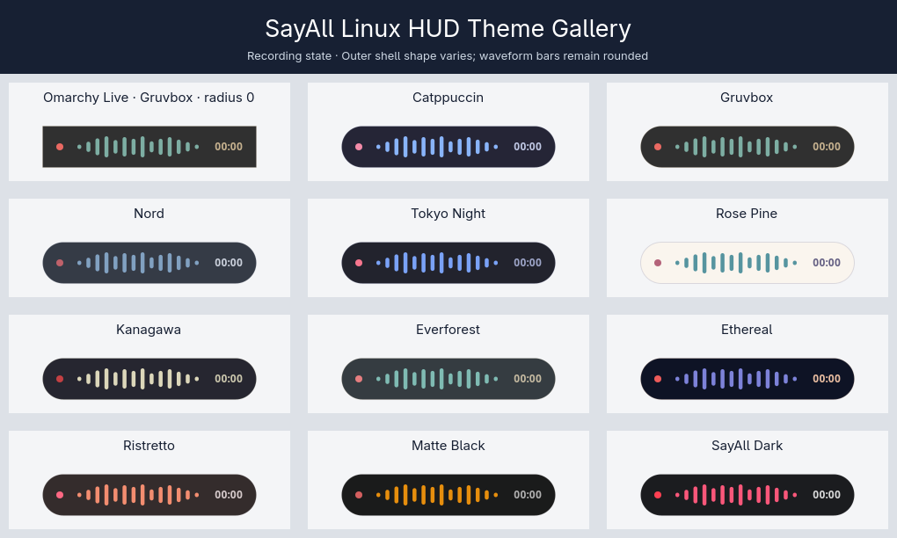

# SayAll

A voice-dictation product for Linux and macOS. Toggle a hotkey,
speak, toggle again, and text is inserted into your focused window. An optional
Cerebras pass can format the transcript and correct contextually clear terminology
without rewriting the speaker's words.

- **STT:** Deepgram Nova-3 (cloud streaming with REST fallback)
- **Formatting:** optional structured edit-plan pass (Cerebras `gpt-oss-120b`) — corrects
  terminology and structures dictated text without rewriting it
- **Zig dependencies:** one pinned WebSocket library; otherwise Zig's standard
  library
- **Runtime dependencies:** PipeWire `pw-record`, `notify-send`, and either
  Wayland (`wtype`, `wl-copy`) or X11 (`xdotool`, `xsel`) delivery tools
- **Linux HUD:** Rust, GTK4, and gtk4-layer-shell
- **Requires:** Zig 0.16.x

## Platform support

| Platform / target | Current status |
| --- | --- |
| Current, fully updated x86-64 Arch Linux with Omarchy (Wayland/Hyprland) | Supported and tested; native host/CLI and AUR or Arch-targeted archive distribution |
| Apple Silicon (`arm64`), macOS 15.0 or later | Supported since 0.1.7 as a signed, notarized, and stapled native app |
| Windows (`x86_64-windows` compile target) | Core compile readiness only; no app, runtime, package, or installable output |

Arch X11, Arch GNOME/KDE portal sessions, Ubuntu LTS GNOME, Fedora current
GNOME, and KDE on other distributions are exploratory and non-blocking until
they are intentionally supported and packaged. The Arch-built archive is not a
universal Linux binary. Other Linux systems may work but are not supported.
Each macOS
release remains gated on signing, notarization, and physical qualification;
unsigned CI candidates are never distributed. Windows readiness does not
constitute product or runtime support. The accepted
[`0.1.6 macOS architecture ADR`](docs/adr-macos-0.1.6.md) selects the macOS
topology. Linux and macOS use the shared version-2 native-host control contract
defined in [`tests/contracts-0.2`](tests/contracts-0.2/).

## Getting Started

### Apple Silicon macOS

Starting with 0.2.0, download the signed, notarized, and stapled Apple Silicon
DMG from the GitHub release, open it, drag `SayAll.app` to `/Applications`, and
launch it on macOS 15.0 or later. The immutable 0.1.7 and 0.1.8 releases use ZIP
archives instead.
Normal CI also exercises an ad-hoc-signed build that must never be distributed.
The app bundles a native terminal client. From the menu bar, choose **Install
Command Line Tool…** and approve the macOS administrator prompt to link the
signed helper at `/usr/local/bin/sayall`; SayAll never changes shell startup
files or replaces an existing unrelated path. Choose **Remove Command Line
Tool…** before deleting a directly installed app; removal revalidates that the
link still belongs to that exact app before requesting administrator access.

The official Homebrew Cask installs the same app and exposes its bundled CLI
using Homebrew's managed binary shim:

```sh
brew install saiemsaeed/sayall/sayall
```

The fully qualified name adds the official SayAll tap automatically. After the
tap has been added, Homebrew also accepts the shorter `brew install sayall`.
Ordinary Cask uninstall quits SayAll and removes only the app and Homebrew CLI
shim; it retains `~/.config/sayall`. Use `brew uninstall --zap --cask sayall`
only when configuration and Application Support data should also be removed.

The macOS CLI intentionally exposes only:

```sh
sayall --version       # also: sayall version
sayall status          # does not launch the app
sayall toggle          # launches this CLI's containing SayAll.app if needed
sayall config init     # creates ~/.config/sayall/config.json once, mode 0600
```

`config init` creates its parent with mode `0700` and leaves the Deepgram key
empty for the user to fill. App status, toggle, and configuration reload use a
private, same-UID Unix socket; the menu-bar `Coordinator` remains the state
owner and transcript delivery remains bound to the focus captured when
recording starts.

### Install on Arch Linux or Omarchy

The stable AUR package builds the release from source:

```sh
yay -S sayall
```

Prebuilt and development variants are also available. Install only one variant
at a time:

| Package | Use case |
| --- | --- |
| `sayall` | Build the latest stable release from source |
| `sayall-bin` | Install official prebuilt release binaries |
| `sayall-git` | Build the latest `main` commit from source |

Configure API keys, keeping the file private:

```sh
mkdir -p ~/.config/sayall
$EDITOR ~/.config/sayall/config.json   # see Configuration below
chmod 600 ~/.config/sayall/config.json

# Start SayAll now and on future graphical logins.
sayall setup
```

`sayall setup` enables and restarts the native host service and installs the
default `Ctrl+Slash` Hyprland shortcut for `sayall toggle`. It preserves a
shortcut previously selected or disabled through the SayAll CLI. If
`Ctrl+Slash` is already manually bound to `sayall toggle`, setup recognizes it
as equivalent and leaves the existing line untouched.

Run the installation diagnostics and microphone test:

```sh
sayall --version
sayall doctor
sayall mic-test
```

Verify `sayall status` reports `idle`, then press `Ctrl+Slash`, speak, and press
it again. The transcript should be typed into the focused window.

View or customize the managed shortcut at any time:

```sh
sayall shortcut                 # show the current/default state
sayall shortcut set SUPER+SPACE # choose another Hyprland chord
sayall shortcut reset           # restore Ctrl+Slash
sayall shortcut disable         # keep services, remove the managed binding
```

Shortcut changes are checked against the Hyprland configuration include tree.
SayAll reports the conflicting file and line and does not add an `unbind` or
overwrite another binding. When run inside Hyprland, it reloads the compositor
and checks `hyprctl configerrors`; if safe activation fails, it restores the
previous SayAll files. Outside a Hyprland session it saves the change and tells
you to run `hyprctl reload` inside the session (or log in again).
Variable-based `source`, modifier, and key expressions are not partially
evaluated: shortcut management stops and reports the exact file and line for
manual resolution. A symlinked `hyprland.conf` is likewise rejected before any
shortcut configuration is written.

Update the installed AUR variant and restart the native host with one
command:

```sh
sayall update
sayall --version
sayall doctor
```

`sayall update` detects whether `sayall`, `sayall-bin`, or `sayall-git` owns
the installation, asks `yay` to update that same package, and only restarts the
host service after the package operation succeeds. It deliberately uses the AUR
package rather than overwriting `/usr/bin` directly, preserving package
ownership, dependency handling, checksums, and clean uninstallation. To avoid
losing audio, it refuses to update while the host is recording or processing
a clip. After a successful package operation it restarts `sayall-hud.service` and
re-applies the saved custom, default, or disabled shortcut state. The retired
`sayall-src` name remains recognized by the 0.1.5 and later CLI as a migration
fallback. Installations still running the 0.1.4 `sayall-src` CLI must use the
explicit one-time `yay -S sayall` command below; that older CLI cannot redirect
itself to a package name introduced by a later release.

The 0.1.8 updater continues running its old in-memory service logic after the
package transaction, so the 0.1.8 → 0.2.0 migration is intentionally two-phase.
After the package update finishes, run the newly installed `sayall setup` once.
It verifies the retired daemon is stopped before starting the single native
host; package hooks cannot safely alter every user's systemd manager as root.

#### Migrate from the earlier AUR package names

The package transition does not own or remove
`~/.config/sayall/config.json`. Review the AUR helper's conflict-removal prompt
and switch packages in one operation; do not uninstall the old package first.

- Existing `sayall` users will move to the stable source build on upgrade. To
  keep using official prebuilt artifacts instead, run `yay -S sayall-bin`.
- Existing `sayall-bin` users continue to receive prebuilt artifacts under the
  same package name.
- Existing `sayall-src` users should run `yay -S sayall`. The canonical package
  replaces the retired source-suffixed name, but an AUR merge does not rename
  packages already installed on users' machines.

After any switch, run `sayall setup`, `sayall doctor`, and a short dictation
smoke test. Locally installed units in `~/.config/systemd/user` override the
package units; remove obsolete manual units as described below if diagnostics
show paths under `~/.local/bin`.

#### Migrate from a manual installation

Older instructions installed files under `~/.local/bin` and
`~/.config/systemd/user`. Remove those files before installing an AUR package
so they cannot override the package-managed binaries and services. This does
not remove `~/.config/sayall/config.json`:

```sh
systemctl --user disable --now sayall.service sayall-hud.service
rm -f ~/.local/bin/sayall ~/.local/bin/sayall-hud
rm -f ~/.config/systemd/user/sayall.service \
      ~/.config/systemd/user/sayall-hud.service
systemctl --user daemon-reload
yay -S sayall
sayall setup
sayall doctor
```

### Build from source

Source builds are intended for contributors. Build and test directly from the
checkout rather than copying over an AUR-managed installation:

```sh
zig build test
zig build check-darwin-core   # portable-core check; does not build SayAll.app
zig build check-windows-core  # compile-only; no Windows product or artifact
zig build -Doptimize=ReleaseFast
cargo test --locked --manifest-path ui/linux/Cargo.toml
cargo build --locked --release --manifest-path ui/linux/Cargo.toml

# Stop the packaged host before running a checkout build; both use the same
# socket and configuration.
systemctl --user stop sayall-hud.service
./ui/linux/target/release/sayall-hud --autostart
```

In another terminal, use `./zig-out/bin/sayall status` and `toggle`.
Restart the packaged installation afterwards with
`systemctl --user start sayall-hud.service`.

Print the installed release version with `sayall --version`.

The Darwin core command is only a portable-core compilation check and is not
the native macOS product build. The Windows command is likewise a contributor
readiness check, not an app, runtime, package, or supported product.

After changing `~/.config/sayall/config.json`, reload it without restarting the
application. The host must be idle; validated changes apply to the next
dictation:

```sh
sayall reload
```

Manage recognition keywords locally with the CLI. Quote phrases and any value
whose leading or trailing spaces are intentional:

```sh
sayall keywords list
sayall keywords search protocol
sayall keywords add SayAll "Model Context Protocol" " München "
sayall keywords update SayAll sayALL
# `rename` is an alias for `update`.
sayall keywords delete " München "
sayall keywords clear --confirm
```

Matching for updates and deletion is exact, including spelling, case, Unicode,
and spaces. Search is a substring search with ASCII case folding. Mutating
commands print the command needed to activate the change in a running host; use
`sayall reload` after editing configuration or keywords.

View persistent transcription metrics:

```sh
sayall stats
sayall stats --json
```

Metrics contain only timing, outcome, audio-duration, and numeric output-size
metadata. Transcript text, audio, API keys, provider bodies, and recording
paths are never persisted.

Test the OS-default microphone before dictating:

```sh
sayall mic-test
# Speak for three seconds. The result reports OK, VERY QUIET, or SILENCE.
# Test a particular PipeWire node name or serial:
sayall mic-test 3687
```

Use `journalctl --user -u sayall-hud.service` to inspect native-host startup and
failure diagnostics.

### Install a release archive

Release archives contain the public CLI and application, private worker,
desktop launcher and icon, documentation, licenses, and systemd user-service
file. AUR installation is preferred on Arch Linux. Do not combine this manual
installation with an AUR package. After downloading and verifying the archive's
entry in `SHA256SUMS`, install it for the current user:

```sh
sudo pacman -S --needed pipewire-audio wtype wl-clipboard xdotool xsel libnotify gtk4 gtk4-layer-shell
sha256sum --check --ignore-missing SHA256SUMS
# Replace VERSION with the published version from the archive filename.
tar -xzf sayall-VERSION-linux-x86_64.tar.gz
cd sayall-VERSION-linux-x86_64
install -Dm755 -t ~/.local/bin bin/sayall bin/sayall-hud
install -Dm755 lib/sayall/sayall-process ~/.local/lib/sayall/sayall-process
install -Dm644 -t ~/.config/systemd/user share/systemd/user/*.service
install -Dm644 -t ~/.local/share/applications share/applications/*.desktop
install -Dm644 -t ~/.local/share/icons/hicolor/scalable/apps \
  share/icons/hicolor/scalable/apps/*.svg
systemctl --user daemon-reload
systemctl --user enable --now sayall-hud.service
```

Configuration and shortcut setup are the same as for an AUR installation; run
`sayall setup` after installing the files and user units.

### Uninstall

Disable the managed shortcut while the CLI is still installed, then stop the
services and remove the package variant:

```sh
sayall shortcut disable
systemctl --user disable --now sayall.service sayall-hud.service
yay -Rns sayall # or sayall-bin / sayall-git
```

If disable reports that the shortcut is an external manual binding, remove
that `sayall toggle` line from `~/.config/hypr/bindings.conf` instead.

For a standalone release-archive installation, replace the `yay` command above
with removal of the files installed by the archive, then reload the user manager:

```sh
rm -f ~/.local/bin/sayall ~/.local/bin/sayall-hud \
  ~/.local/lib/sayall/sayall-process \
  ~/.config/systemd/user/sayall-hud.service \
  ~/.local/share/applications/dev.sayall.Hud.desktop \
  ~/.local/share/icons/hicolor/scalable/apps/dev.sayall.Hud.svg
systemctl --user daemon-reload
```

Package removal deliberately preserves user configuration. To remove every
shortcut trace as well, delete the block between `BEGIN SAYALL MANAGED
SHORTCUT` and `END SAYALL MANAGED SHORTCUT` in
`~/.config/hypr/hyprland.conf`, plus `~/.config/hypr/sayall.conf` and
`~/.config/sayall/shortcut.json`, then run `hyprctl reload`. After all SayAll
commands have stopped, `~/.config/sayall/shortcut.lock` can also be removed.
Keep `~/.config/sayall/config.json` if you may reinstall and want to retain
provider settings.

## Architecture

### macOS

The stable bundle identifier is `pro.leets.sayall`. Swift/AppKit owns the menu
bar UI, lifecycle, config loading, native microphone/TCC,
Control+/ Carbon hotkey and menu fallback, Accessibility-authorized typing and
pasting with clipboard fallback, temporary audio, and packaging. It invokes the
bundled `sayall-process` helper once per recording. The Zig helper streams private raw
PCM to Deepgram during capture, validates the completed PCM S16LE mono 16 kHz
WAV, falls back to REST when streaming fails, and optionally runs Cerebras cleanup.
The signed `sayall` helper uses a separate bounded JSON request/response socket
under a mode-0700 per-user directory for same-UID `status`, `toggle`, and `reload` calls.
The app's `Coordinator` handles all three methods on the main actor; a nonblocking
process lock prevents another app instance from replacing its live endpoint.

The app and helper exchange bounded, versioned JSON over inherited stdin and
stdout. API keys are never passed in argv or environment variables and are not
logged. Canonical WAV and streaming PCM paths are private; post-stop processing
has a 45-second app-side timeout. Raw audio is deleted after every terminal path,
with startup scavenging for interrupted runs. There is no daemon, Linux protocol
v1 endpoint, launchd service, login item, or transcript history on macOS. See
the [macOS architecture ADR](docs/adr-macos-0.1.6.md) and
[macOS CLI ADR](docs/adr-macos-cli.md).

Provider settings use the same `$XDG_CONFIG_HOME/sayall/config.json` or
`~/.config/sayall/config.json` schema as Linux. The app reloads it before each
recording. Environment overrides work when the app is launched from a shell;
Finder launches do not inherit interactive shell-file variables. Audio is streamed
to Deepgram during recording and, only when `llm.enabled` is true and a Cerebras key is present, the
transcript is sent to Cerebras. SayAll collects no telemetry.

### Linux

```
Hyprland/portal ──▶ Rust/GTK native host ◀──v2 socket── sayall CLI
                            │ toggle ON
                      spawn pw-record (raw PCM)
                            │ private bounded protocol
                      Zig sayall-process worker
                            │ streaming + REST fallback
                      Deepgram → optional Cerebras cleanup
                            │ transcript result
                      wtype/wl-copy or xdotool/xsel
```

The Rust process owns capture, session state, UI, notifications, shortcuts, and
delivery. It launches the private Zig worker for platform-neutral provider
processing. The public Zig CLI controls the same host over the bounded,
same-user socket at `$XDG_RUNTIME_DIR/sayall.sock`; the UI never invokes the CLI.

## Linux HUD

The HUD is a transparent bottom-center layer-shell surface for Hyprland,
wlroots compositors, and KDE Wayland. It displays:

- live recording bars driven by RMS/peak events;
- elapsed recording time;
- transcribing, cleanup, and typing stages;
- short success and error states.

The native-platform ownership boundaries and worker/control contracts are
defined by the [unified architecture ADR](docs/adr-unified-core-cli-and-native-hosts.md).

## Provider Choices (and why)

### STT: Deepgram Nova-3 — ~$0.26/hr

| Candidate | Cost/hr | Latency (10s clip) | Verdict |
|---|---|---|---|
| **Deepgram Nova-3** ✅ | ~$0.26 | ~0.3–0.8s | Smart Formatting (punctuation/casing) included free; simplest API (raw WAV body, no multipart — a real win in Zig); $200 free credit ≈ 770 hrs |
| Cerebras Whisper v3 Turbo | $0.04 | ~0.3–0.6s | Cheapest/fastest; roadmap candidate |
| OpenAI gpt-4o-transcribe | $0.36 | ~1–2s | Strong alternative; not implemented yet |
| AssemblyAI Universal-3.5 | $0.21 | slowest | Upload→poll model; wrong fit for dictation |

### Optional LLM formatting: Cerebras `gpt-oss-120b`

The formatter makes one low-reasoning chat-completions request with a strict
JSON schema. The model returns only anchored edits; Zig validates and renders
them from the original Deepgram lexical tokens. It therefore cannot append an
answer or recommendation. Any provider, schema, anchor, correction, rendering,
or provenance failure retains the deterministic Clean result. Only a local
Clean failure falls back to the raw transcript with a warning. Check Cerebras's
current model page for speed and pricing. Only Cerebras is implemented.

**Realistic cost:** ~2h dictation/day → ~$10/mo STT (after free credit) + ~$0.15/mo LLM.

## Project Layout

```
sayall/
├── build.zig                  # zig build, native target
├── build.zig.zon              # package metadata and minimum Zig version
├── sayall-hud.service         # native host systemd user unit
├── daemon/
│   ├── main.zig               # CLI, mic-test, and transcribe commands
│   ├── keywords.zig           # XDG keyword persistence and validation
│   ├── daemon.zig             # recording/processing state machine
│   ├── ipc.zig                # unix socket @ $XDG_RUNTIME_DIR/sayall.sock
│   ├── platform.zig           # compile-time runtime selection/capabilities
│   ├── platform/linux.zig     # Linux capture, output, notification, paths
│   ├── platform/darwin.zig    # explicit unsupported Darwin runtime
│   ├── platform/windows.zig   # explicit unsupported Windows runtime
│   ├── recorder.zig           # portable PCM/WAV validation and analysis
│   ├── stt/deepgram.zig       # raw-body POST, JSON parse
│   ├── llm/cloud_planner.zig           # OpenAI-compatible chat completions
│   ├── typer.zig              # direct wtype delivery, clipboard fallback
│   ├── config.zig             # ~/.config/sayall/config.json + env var keys
│   └── notify.zig             # platform notification dispatch
├── ui/<platform>/             # platform-specific HUD/application UI
└── README.md
```

## Implemented Behavior

1. **Native host/control** — one Rust session owner, bounded same-user v2
   control clients, and a state machine allowing one recording at a time.
2. **Recording** — capture raw 16 kHz mono s16 PCM, publish live RMS/peak
   events, and generate a WAV for Deepgram after stopping. Reject clips below
   the configured minimum duration.
3. **Deepgram STT** — streaming Nova-3 with REST fallback and configurable
   Smart Format, punctuation, spoken dictation commands, numerals, measurements,
   and keyterm prompting. REST responses parse
   `results.channels[0].alternatives[0].transcript`.
4. **Transcript processing** — Verbatim returns finalized Deepgram output
   without a provider request; Clean performs deterministic local cleanup;
   Polished applies Clean once and requests one structured edit plan from
   Cerebras. Polished preserves the speaker's meaning while correcting
   contextually unambiguous terminology, punctuation, and capitalization;
   adding paragraph breaks; and formatting clearly dictated or enumerated
   lists. The effective keyword list is supplied as a spelling glossary for
   terms such as `SayAll`. An anchored edit-plan validator and source-based
   renderer reject answers, broad rewrites, and unverifiable edits. Rejected or
   failed Polished plans silently fall back to the deterministic Clean result.

5. **Output** — type the complete transcript with `wtype`, copy it with
    `wl-copy`, or copy and paste it with one `Ctrl+V` shortcut. This works in
    native Wayland and XWayland windows via Hyprland's virtual-keyboard-v1.
    Clipboard copy remains the fallback when direct typing fails.
6. **Operational safeguards** — strict config validation, unique recording
   paths, bounded provider responses, notify-send feedback, privacy-safe
   latency logging, maximum recording guard, and a systemd user unit.

## Configuration

`$XDG_CONFIG_HOME/sayall/config.json`, falling back to
`~/.config/sayall/config.json` (shared by Linux and macOS; keys overridable by
the process environment):

```json
{
  "stt": {
    "provider": "deepgram",
    "api_key": "$DEEPGRAM_API_KEY",
    "model": "nova-3",
    "language": "en",
    "region": "eu",
    "smart_format": false,
    "punctuate": false,
    "dictation": false,
    "numerals": false,
    "measurements": false,
    "streaming": true,
    "stream_finalize_timeout_ms": 2000
  },
  "llm": {
    "provider": "cerebras",
    "api_key": "$CEREBRAS_API_KEY",
    "model": "gpt-oss-120b",
    "enabled": false
  },
  "processing": { "mode": "verbatim" },
  "output": { "method": "type", "trailing_space": true },
  "recording": { "max_seconds": 300, "min_ms": 300, "source": "" },
  "metrics": { "enabled": true, "history_max_entries": 1000, "expose_api": true },
  "hud": { "show_timer": true, "theme": "omarchy", "shape": "rounded" },
  "notifications": true
}
```

Deepgram formatting is opt-in. Set the corresponding `stt` flags to `true` to
enable Smart Format, automatic punctuation, spoken dictation commands, numeric
digits, or abbreviated measurements. SayAll sends every flag explicitly to
Deepgram for both streaming transcription and the REST fallback; omitted flags
default to `false`. Deepgram requires `punctuate` when `dictation` is enabled.

`processing.mode` accepts `verbatim`, `clean`, or `polished`. Verbatim is the
default and sends no transcript to Cerebras. Clean performs deterministic local
cleanup without a provider request. Polished requires a Cerebras API key and
the `gpt-oss-120b` model; if its request or validated transformation fails,
SayAll silently delivers the deterministic Clean result. Existing
configurations that omit `processing.mode` and set `llm.enabled` to `true`
retain their legacy formatting behavior for this migration cycle. The legacy
`llama-3.1-8b-instant` model remains syntactically accepted for that
compatibility path but cannot be selected for Polished mode.

`hud.show_timer` defaults to `true` and displays recording duration as `mm:ss`.
Set it to `false` for the centered recording layout without a timer or reserved
timer space.

On Linux, `hud.theme` defaults to `omarchy`. SayAll reads the active Omarchy
palette from `~/.local/state/omarchy/current/theme/colors.toml` whenever the HUD
opens, so stock and user-installed Omarchy themes are adopted automatically;
it falls back to SayAll's original `dark` palette when Omarchy is unavailable.
In `omarchy` mode, SayAll also reads Hyprland's effective
`decoration:rounding` value and ignores `hud.shape`, matching active window
corners including theme and user overrides. Corner selection affects only the
outer HUD and settings surfaces; waveform bars and other internal controls stay
rounded.
The preconfigured alternatives are `catppuccin`, `gruvbox`, `nord`,
`tokyo-night`, `rose-pine`, `kanagawa`, `everforest`, `ethereal`, `ristretto`,
and `matte-black` (plus `dark`). `hud.shape` accepts `rounded`, `soft`, or
`square` for these preconfigured palettes and applies the selected corner
treatment to the HUD and Linux settings window. These appearance fields are
ignored by the macOS UI.



For a Finder-launched macOS app, put literal API keys in this mode-`0600` file.
References such as `"$DEEPGRAM_API_KEY"` resolve only when that variable is in
SayAll's process environment—for example when launching the executable from a
shell that exports it. Shell startup files are not read by Finder-launched apps.

By default SayAll lets PipeWire select `@DEFAULT_AUDIO_SOURCE@`. To pin a
specific input, set `recording.source` to a PipeWire node name or serial:

```json
"recording": {
  "max_seconds": 300,
  "min_ms": 300,
  "source": ""
}
```

An empty `source` follows the OS default, including future default-device
changes.

Output method `clipboard` copies without inserting. On macOS, `type` inserts
at the verified original cursor using clipboard-backed `Command+V`; `paste` is
an explicit name for the same robust macOS behavior. On Linux, `type` passes
the transcript directly to `wtype` or `xdotool`, while `paste` copies and sends
one `Ctrl+V` to the field focused at delivery time; Linux does not retain and
revalidate the recording-start target as macOS does. Terminals commonly reserve
`Ctrl+V` for literal input and may
require a user keybinding that maps it to clipboard paste, or can use
`clipboard` instead. If insertion becomes unsafe or fails, SayAll preserves
the transcript on the clipboard and reports the fallback.

Deepgram region is allow-listed to `global`, `eu`, or `au`. The regional
endpoint changes data-processing location and network latency without changing
credentials or the Nova-3 model.

Keywords are a global vocabulary of names, jargon, and phrases that Nova-3
should recognize more accurately. Manage them with `sayall keywords`; the
authoritative file is `$XDG_CONFIG_HOME/sayall/keywords.json`, falling back to
`~/.config/sayall/keywords.json`. It is written atomically with mode `0600`, and
the containing directory is restricted to mode `0700`. Keep the list focused
on uncommon or frequently misrecognized terminology. SayAll rejects empty or
duplicate entries, control characters, entries over 256 bytes, more than 100
entries, and lists over 4096 bytes. Deepgram also enforces its request token
limit.

For compatibility, if the keyword file is absent and an older config contains
`stt.keyterms`, Linux SayAll validates and atomically imports that list on first load;
the macOS app consumes the validated legacy list without modifying configuration.
On Linux, legacy exact duplicates are collapsed without reordering: the first
spelling, case, and spacing is retained. The keyword file is authoritative after
migration; the old field is not rewritten and can be removed from `config.json`
after verifying `sayall keywords list`. Streaming, REST fallback, and LLM
cleanup all consume this same effective keyword list while preserving spelling,
case, spaces, and Unicode.

Streaming sends raw 16 kHz mono PCM while recording and inserts text only after
Deepgram finalizes the stream. The complete local recording is retained until
then and automatically uses regional REST transcription if connection,
protocol, or finalization fails. Set `stt.streaming` to `false` to force REST.
Socket connect, handshake, read, write, and finalization waits are bounded.
Cancellation also stops waiting after a fixed deadline; a pathological system
DNS resolver may leave its detached lookup worker alive until resolution ends.

Metrics are stored at `$XDG_STATE_HOME/sayall/metrics-v2.json`, or
`~/.local/state/sayall/metrics-v2.json`. Existing v1 counters and history are
imported automatically. The directory is mode `0700`, files are mode `0600`,
all-time counters are retained, and detailed metadata rotates after the
configured number of entries. Normalized statistics use successful entries in
that bounded history; legacy records have no word or character counts. Stream
failures are recorded separately from the successful REST fallback. Provider
latency covers the full provider operation; stream stop-to-final latency is
also retained as a dedicated responsiveness metric.

### Backup and removal

Back up both `config.json` and `keywords.json` from the SayAll directory under
`$XDG_CONFIG_HOME` (or `~/.config/sayall`). `config.json` can contain API-key
references or secrets, so keep backups private. Package removal and the manual
installation cleanup commands intentionally leave this directory in place.

After uninstalling SayAll, remove its local configuration only if it is no
longer needed. This is irreversible unless backed up:

```sh
# Default XDG location; adjust if XDG_CONFIG_HOME is set.
rm ~/.config/sayall/config.json ~/.config/sayall/keywords.json
rm -f ~/.config/sayall/keywords.json.lock
rmdir ~/.config/sayall  # succeeds only when the directory is otherwise empty
```

The adjacent `keywords.json.lock` is coordination metadata; remove it only
after all SayAll processes have stopped. Persistent metrics are separate under
`$XDG_STATE_HOME/sayall` (or `~/.local/state/sayall`) and must be backed up or
removed independently.

## Hyprland Setup

The supported Omarchy setup is managed through the CLI:

```sh
sayall setup                  # services + saved shortcut; default Ctrl+Slash
sayall shortcut show
sayall shortcut set SUPER+H
sayall shortcut reset
sayall shortcut disable
```

SayAll stores shortcut intent in `~/.config/sayall/shortcut.json`, generates
`~/.config/hypr/sayall.conf`, and adds one marked source block to
`~/.config/hypr/hyprland.conf`. Repeated setup and upgrade runs are idempotent
and keep a custom or disabled state. A different existing binding is never
silently replaced. Shortcut errors do not prevent `sayall setup` from enabling
and restarting the native host service, though setup exits unsuccessfully
until the shortcut conflict is resolved or the managed shortcut is disabled.

On upgrade from a manual `bind = CTRL, SLASH, exec, sayall toggle` line, setup
recognizes the equivalent binding and does not take ownership of or rewrite
it. `shortcut set` and `shortcut disable` will likewise refuse to claim that
external binding; remove the manual line first if you later want the SayAll CLI
to manage the shortcut. `shortcut reset` treats the external default as already
satisfied.

## Limitations

- **Support scope** — Linux support is limited to current, fully updated x86-64
  Arch Linux running Omarchy with Hyprland Wayland. Arch X11, Arch GNOME/KDE
  portal sessions, Ubuntu LTS GNOME, Fedora current GNOME, and KDE elsewhere
  are exploratory/non-blocking and are not supported release cells. The Linux
  archive targets Arch; it is not a universal Linux package. macOS support is
  limited to Apple Silicon running macOS 15.0 or later; Windows is unsupported.
- **macOS distribution** — source and CI readiness are not a distributable
  product; no unsigned, unnotarized, or unqualified macOS build is published.
- **REST network deadlines** — provider responses are memory-bounded, but an
  explicit end-to-end REST cancellation deadline is still roadmap work.
- **Wayland input** — direct output requires a compositor implementing the
  virtual-keyboard protocol used by `wtype`.
- **Final-only output** — audio streams while recording, but text is inserted
  only after Deepgram returns its final transcript.

## Success Criteria

Press bind → speak → press bind → text typed into the focused window. The
current test suite covers configuration validation, strict WAV parsing and
level analysis, provider response parsing, worker framing, and native-host
control behavior.

## Versioning and releases

SayAll follows [Semantic Versioning](https://semver.org/). The Linux native host,
CLI, macOS app, and bundled private workers share one product version. macOS
release artifacts remain unpublished until they complete signing, notarization,
and physical qualification. Protocol versions are independent of product versions.

For stable 1.x releases, public configuration and control protocols remain
backward compatible within the major version: extensions are additive, and
persisted-format changes include tested migrations. The private processing
worker is not a public compatibility surface; it ships atomically at the same
product version as its host and CLI, and version/protocol mismatch must be
rejected loudly rather than guessed around. Metrics and other persistent state
must migrate without losing accepted data; qualification covers backup,
upgrade, and rollback behavior, including an explicit warning or refusal when
an older release cannot safely read migrated state. See `CHANGELOG.md` for
user-visible changes, [the unified architecture](docs/adr-unified-core-cli-and-native-hosts.md)
for protocol boundaries, and `docs/releasing.md` for the release process.

SayAll is licensed under the MIT License. See `LICENSE`.
